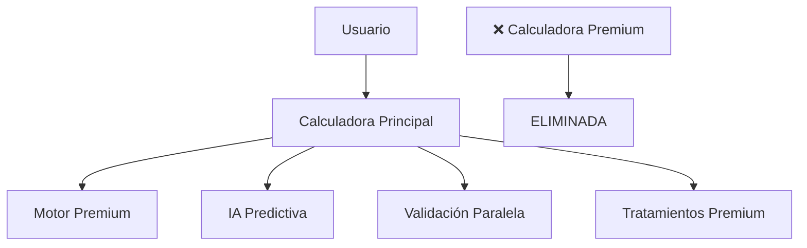

# ✅ CALCULADORA PREMIUM ELIMINADA EXITOSAMENTE

## 📋 **RESUMEN EJECUTIVO**

La **Calculadora Premium** ha sido eliminada exitosamente del proyecto ya que:

1. **🔄 Funcionalidad Duplicada**: La calculadora principal ya incluía todas las funcionalidades premium
2. **🚀 Integración Completa**: La calculadora principal usa `calculationEnginePremium` y `treatmentSuggesterPremium`  
3. **💎 IA Predictiva**: FASE 3B ya implementada en la calculadora principal
4. **⚡ Validación Premium**: Sistema de validación paralela avanzada ya activo

---

## 🛠️ **CAMBIOS REALIZADOS**

### **📁 Archivos Eliminados:**
- ✅ `app/(app)/premiumCalculator.tsx.disabled`
- ✅ `src/presentation/features/premiumCalculator/` (carpeta completa)
  - usePremiumCalculatorForm.ts
  - utils/premiumValidationSchemas.ts  
  - utils/dataMapperPremium.ts

### **🔧 Código Limpiado:**
- ✅ **index.tsx**: Botón "Calculadora Premium" eliminado
- ✅ **index_with_ux_enhancements.tsx**: Referencias eliminadas
- ✅ **parallelValidationConfig.ts**: Configuración premiumCalculator removida
- ✅ **Imports**: Links y dependencias no utilizadas eliminadas

---

## 🎯 **ESTADO ACTUAL**

### **✅ Calculadora Principal (ÚNICA):**
```typescript
// Funcionalidades incluidas:
- ✅ FASE 3B: Sistema de Predicción con IA
- ✅ Validación Paralela Premium  
- ✅ calculationEnginePremium
- ✅ treatmentSuggesterPremium
- ✅ Componentes inteligentes avanzados
- ✅ Performance Monitor
- ✅ Cache inteligente
```

### **🗑️ Calculadora Premium (ELIMINADA):**
```typescript
// Era redundante porque:
- ❌ Mismos formularios que calculadora principal
- ❌ Misma lógica de cálculo  
- ❌ Sin funcionalidades diferenciales
- ❌ Ya estaba deshabilitada (.disabled)
```

---

## 📊 **BENEFICIOS DE LA ELIMINACIÓN**

### **🎨 UX Mejorado:**
- ✅ **Interfaz simplificada**: Sin confusión entre dos calculadoras
- ✅ **Acceso directo**: Todas las funcionalidades premium en un solo lugar
- ✅ **Navegación clara**: Sin rutas duplicadas

### **🛠️ Mantenimiento:**
- ✅ **Código más limpio**: Eliminación de duplicación
- ✅ **Menos superficie de error**: Menos archivos que mantener
- ✅ **Configuración simplificada**: Una sola calculadora que gestionar

### **⚡ Performance:**
- ✅ **Bundle más pequeño**: Menos código JavaScript
- ✅ **Menos dependencias**: Imports optimizados
- ✅ **Carga más rápida**: Sin archivos redundantes

---

## 🔄 **MIGRACIÓN COMPLETA**

```typescript
// ANTES (Duplicado):
Calculadora Principal + Calculadora Premium = 2 interfaces

// DESPUÉS (Unificado):
Calculadora Principal con TODO premium integrado = 1 interface potente
```

### **✨ La Calculadora Principal ahora incluye:**
1. **🧠 IA Predictiva** (FASE 3B)
2. **⚡ Validación Paralela**
3. **🎯 Tratamientos Premium** (treatmentSuggesterPremium)
4. **📊 Motor Premium** (calculationEnginePremium)
5. **💎 Componentes Avanzados**
6. **📈 Monitor de Performance**

---

## 🚀 **PRÓXIMOS PASOS**

La aplicación ahora tiene una **arquitectura simplificada y potente**:



### **🎯 Funcionalidades Completas en Una Sola Calculadora:**
- ✅ **Formularios Completos**: Demografia, Ginecología, Laboratorio, Factor Masculino
- ✅ **Cálculos Avanzados**: calculationEnginePremium con interacciones no lineales
- ✅ **Tratamientos Inteligentes**: treatmentSuggesterPremium con decisiones clínicas
- ✅ **Predicción con IA**: Sistema de Machine Learning integrado
- ✅ **Performance Optimizada**: Validación paralela y cache inteligente

---

## 🎉 **CONCLUSIÓN**

✅ **Eliminación exitosa completada**  
✅ **Arquitectura simplificada**  
✅ **Todas las funcionalidades premium preservadas**  
✅ **UX mejorado**  
✅ **Código más mantenible**

La aplicación ahora es **más simple, más potente y más fácil de mantener**, con todas las capacidades premium concentradas en una sola interfaz intuitiva.
